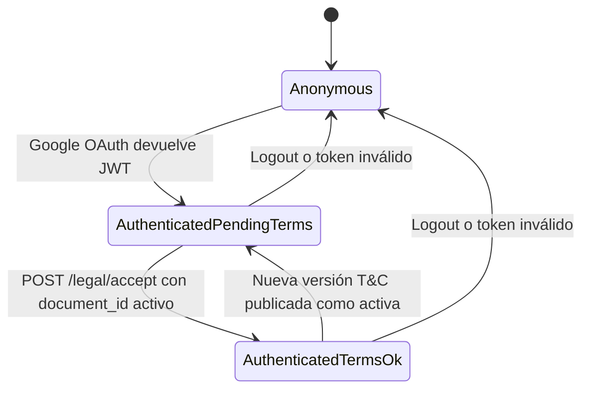

# Máquina de estados: sesión y aceptación de términos (JWT)

Este documento describe los estados de acceso para la aplicación Utopp cuando la autenticación es por **Google OAuth** y el acceso a la API de negocio exige **aceptación vigente** de Términos y Condiciones.

## Estados

| Estado | JWT | Acceso `/legal/*` | Acceso APIs de negocio (`/users`, `/posts`, …) |
|--------|-----|-------------------|--------------------------------------------------|
| **Anonymous** | Ninguno | `GET /legal/terms/current` sí | Solo rutas públicas (p. ej. `GET /feed` sin personalización) |
| **AuthenticatedPendingTerms** | Bearer válido (`sub` = user id) | `GET /legal/terms/current`, `POST /legal/accept`, `GET /auth/me` (recomendado) | **403** `TERMS_RECONSENT_REQUIRED` |
| **AuthenticatedTermsOk** | Mismo formato JWT | Libre | Libre (sujeto a otros permisos) |

## Transiciones

## Decisiones de implementación (actual)

1. **Un solo tipo de JWT**  
   No se emite un segundo token “pre-legal” en el MVP: tras Google login/register el usuario recibe el mismo `access_token`. La restricción se aplica en **dependencias FastAPI** que consultan la BD (aceptación para el `legal_document` activo).

2. **Fuente de verdad**  
   Tablas `legal_documents` (versión activa) y `terms_acceptances` (historial inmutable). Opcionalmente `users.last_accepted_legal_document_id` para lecturas rápidas.

3. **`GET /auth/me` sin guard de términos**  
   Permite al frontend saber `id` / `email` / onboarding mientras muestra la pantalla de aceptación.

4. **`get_optional_user` (feed)**  
   Si hay Bearer válido y el usuario **no** tiene términos vigentes, se responde **403** con el mismo código estable (evita usar el feed autenticado como bypass).

5. **Re-consent**  
   Al activar una nueva fila en `legal_documents`, los usuarios con aceptación solo de la versión anterior pasan a equivaler a **AuthenticatedPendingTerms** hasta un nuevo `POST /legal/accept`.

## Códigos de error estables

| HTTP | `detail.code` | Uso |
|------|----------------|-----|
| 403 | `TERMS_RECONSENT_REQUIRED` | JWT ok; falta aceptación de la versión activa |

## Headers recomendados

- `Idempotency-Key` en `POST /legal/accept` para reintentos seguros.
- `X-Request-Id` para correlación con logs de auditoría (futuro).
