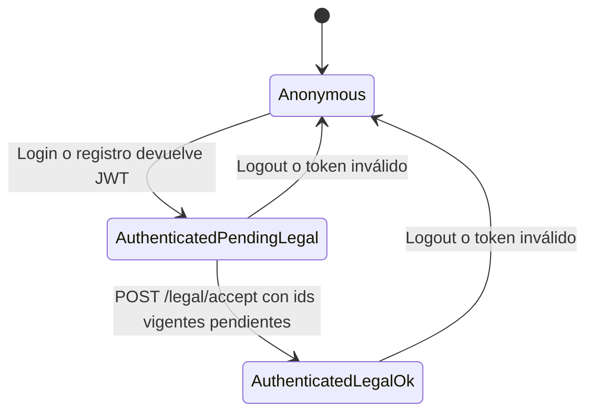

# Máquina de estados: sesión y consentimiento legal (JWT)

Describe el acceso cuando la API exige **aceptación vigente** de **Términos y condiciones** y **Política de datos y privacidad** (dos slugs activos en `legal_documents`).

## Estados

| Estado | JWT | Acceso `/legal/*` | Acceso APIs de negocio (`/users`, `/posts`, `/roles`, …) |
|--------|-----|-------------------|----------------------------------------------------------|
| **Anonymous** | Ninguno | `GET /legal/terms/current`, `GET /legal/privacy/current` | Solo rutas públicas |
| **AuthenticatedPendingLegal** | Bearer válido (`sub` = user id) | Lectura de documentos + `POST /legal/accept` + `GET /auth/me` | **403** `TERMS_RECONSENT_REQUIRED` |
| **AuthenticatedLegalOk** | Mismo JWT | Libre | Libre (sujeto a otros permisos) |

## Transiciones

## Decisiones de implementación (actual)

1. **Un solo tipo de JWT**  
   Tras login o registro el usuario recibe el mismo `access_token`. La restricción se aplica en dependencias FastAPI que consultan la BD.

2. **Fuente de verdad del texto**  
   Markdown en `app/legal/terms.md` y `app/legal/privacy.md`. Al **arranque** del API se ejecuta `sync_legal_documents_from_repo`: actualiza el contenido de la fila activa de cada slug **sin cambiar el `id`**, de modo que editar el Markdown no invalida masivamente las aceptaciones ya registradas.

3. **Evidencia de aceptación**  
   Tabla `terms_acceptances` (historial) y columnas `users.last_accepted_legal_document_id` / `users.last_accepted_privacy_document_id` para comprobaciones rápidas por slug.

4. **`GET /auth/me`**  
   Expone `needs_terms` (bloqueo global si falta cualquier consentimiento), `needs_terms_consent` y `needs_privacy_consent` para la UI.

5. **Registro**  
   `POST /auth/register` y `POST /google/register` exigen ids de documentos activos y registran ambas aceptaciones al crear el usuario.

## Códigos de error estables

| HTTP | `detail.code` | Uso |
|------|----------------|-----|
| 403 | `TERMS_RECONSENT_REQUIRED` | JWT ok; falta aceptación de algún documento activo requerido |

## Headers recomendados

- `Idempotency-Key` en `POST /legal/accept` para reintentos seguros.
